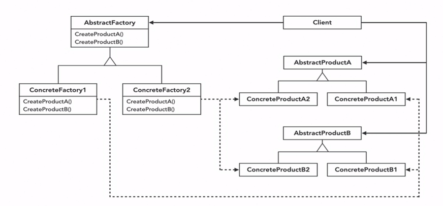

# 🚗🔧 Abstract Factory Design Pattern in C++ & Java 🚀🎉

Welcome to the world of **Abstract Factory Design Pattern in C++ & Java**! This source code exemplifies the powerful and flexible nature of this pattern in the context of car manufacturing.

## 📁 Source Code Overview

The provided C++ & Java source code demonstrates the implementation of the Abstract Factory Design Pattern to create cars with different types of doors and engines. Let's break down the key components:

### 🚪 Door Objects

- **`Door` Class:** An abstract class defining the interface for doors.
- **`GasCarDoor` Class:** Concrete implementation of the door for gas cars.
- **`ElectricCarDoor` Class:** Concrete implementation of the door for electric cars.

### 🔧 Engine Objects

- **`Engine` Class:** An abstract class defining the interface for engines.
- **`GasEngine` Class:** Concrete implementation of the engine for gas cars.
- **`ElectricEngine` Class:** Concrete implementation of the engine for electric cars.

### 🏭 Factories

- **`CarFactory` Class:** An abstract class defining the interface for car factories.
- **`GasCarFactory` Class:** Concrete factory for producing gas cars, implementing the `CarFactory` interface.
- **`ElectricCarFactory` Class:** Concrete factory for producing electric cars, also implementing the `CarFactory` interface.

### 🚗 Main Function

The `main` function acts as a client that interacts with the abstract factory and creates a car based on user input.

### 🖼️ Visual Aid: Decoding the UML Diagram 🖼️

## 📄 Source Files

- **[`abstractFactory.cpp`](./abstractFactory.cpp), [`abstractFactory.java`](./abstractFactory.java):** The main source file containing the implementation.

Feel free to explore the source files for a deeper understanding of the Abstract Factory Design Pattern in action.

## 🚀 Getting Started

To run this example, compile the source code & follow the on-screen prompts to select a car type (Gasoline or Electric) and witness the magic of abstract factory pattern creating doors and engines seamlessly.

Share your thoughts and experiences with the code in the discussions section below! 👇

🔗 **#AbstractFactoryPattern #CPlusPlusProgramming #DesignPatterns #SoftwareEngineering #CodingCommunity #TechInnovation**

Happy Coding! 🚀
