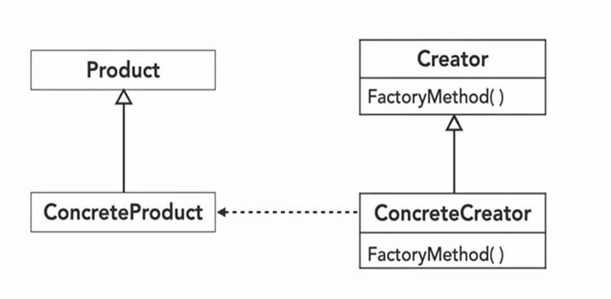

# Spotlight: Factory Method 🔍

The Factory Method is a creational design pattern that provides an interface for creating objects in a superclass, while allowing subclasses to alter the type of objects they create. This pattern is a key player in object-oriented design and is widely used in various software systems. In this repository, we'll delve into the Factory Method Pattern, discussing its advantages, providing code examples, and exploring its practical applications.

## Advantages of Factory Method Pattern 🌟

### Flexibility and Encapsulation 🔄

The Factory Method Pattern encapsulates the object creation logic, which promotes loose coupling between the client code and the objects it uses. This encapsulation makes the code easier to manage and modify, and it enhances flexibility and maintainability.

### Dynamic Object Creation 🎭

The Factory Method Pattern allows subclasses to decide which objects to create. This is particularly useful when the exact details of object construction are uncertain or need to be deferred until runtime. The Factory Method Pattern reduces code duplication and enhances efficiency, readability, and polymorphism.

## Real-World Use Cases of Factory Method Pattern 🌍

### Library Frameworks 📚

The Factory Method Pattern is commonly used in library frameworks. It provides an interface that allows developers to extend and customize the behavior of a library.

### Plug-in Architectures 🔌

In applications with extensible plug-in architectures, the Factory Method Pattern simplifies the addition of new plug-ins without modifying existing code.

### Testing 🧪

Factories can be used to create mock objects for unit testing, making the Factory Method Pattern a valuable tool in testing scenarios.

## When To Use Factory Method Pattern? 🤷‍♀️

Consider using the Factory Method Pattern when:

- The object creation process has a high level of complexity.
- You need to return different instances of an object depending on dynamic factors or application configuration.
- You need to create different small objects that share some properties.

## UML Diagram and Source Code 🗺️📁

We have included a UML diagram in this repository to provide a visual representation of the Factory Method Pattern. This diagram can help you understand its structure and flow more easily.

We have also included the source code for a simple implementation of the Factory Method Pattern. You can use this code as a reference or starting point for your own projects. Navigate to the source code folder to access the code files.

Let's explore the Factory Method Pattern together and enhance our software design skills! 🚀

## Factory Method Pattern in C/C++ & Java

We have implemented a simple version of the Factory Method Pattern in C/C++ & Java. Let's walk through the code to understand its use.

You can find the complete code [in C/C++](./FactoryMethod.cpp), [in Java](./FactoryMethod.java).

In this code:

- `Shape` is an abstract base class that declares a virtual function `draw()`. This function is implemented by the concrete classes `Circle` and `Rectangle`, which provide their own implementations of `draw()`.
- `ShapeFactory` is our factory class. It has a `getShape()` function that takes a string as an argument and returns a pointer to an instance of `Shape`. Depending on the input string, it creates a new instance of either `Circle` or `Rectangle`.
- In the `main()` function, we create an instance of `ShapeFactory` and use it to create a `Circle` object. We then call the `draw()` function on this object, which outputs "Shape is Circle".

This implementation encapsulates the object creation logic in the `ShapeFactory` class, promoting loose coupling and improving code maintainability.

You can learn more about the Factory Method Pattern [here](https://refactoring.guru/design-patterns/factory-method).

🔗 **#DesignPatterns #SoftwareDevelopment #Coding #BestPractices #CreationalPatterns #FactoryMethod #C/C++ #Java**

Happy Coding! 🚀
