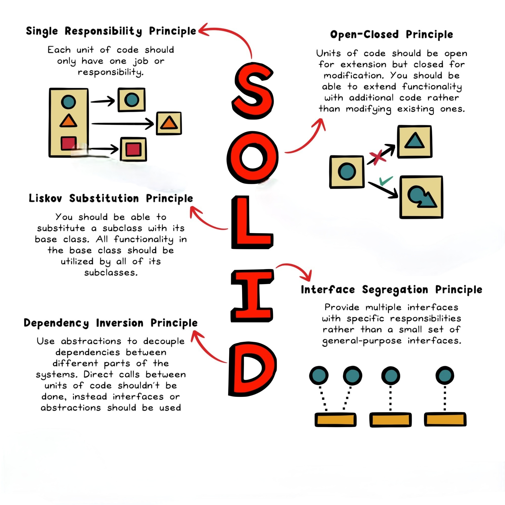

# Mastering SOLID Principles for Robust Software Design 🚀

## Overview

Welcome to the world of SOLID principles – a set of design principles that can elevate your software development game. Coined by Robert C. Martin, these principles provide a foundation for writing clean, scalable, and maintainable code.

## Principles in Detail

### 1. Single Responsibility Principle (SRP)

Ensure your classes have one job, and one job only. This principle advocates for clear and focused responsibilities, making your codebase modular and maintainable.

### 2. Open/Closed Principle (OCP)

Be open to extension, closed to modification. Embrace abstraction and polymorphism for a more flexible codebase that can be easily extended without altering existing code.

### 3. Liskov Substitution Principle (LSP)

Master LSP when a subclass can replace its superclass without breaking the program. Ensure inheritance is used correctly, promoting consistency and compatibility across your codebase.

### 4. Interface Segregation Principle (ISP)

No more bloated interfaces! Keep it lean with ISP. Design small, specific interfaces tailored to the needs of implementing classes, avoiding unnecessary dependencies.

### 5. Dependency Inversion Principle (DIP)

Depend on abstractions, not concretions. Encourage flexibility and decoupling by having classes depend on interfaces rather than concrete classes.

## How to Apply SOLID Principles

Ready to level up your coding skills? Embrace SOLID principles, and you'll be on your way to writing cleaner, more maintainable code.

Here is a diagram that visually summarizes the SOLID principles:

You can find the complete code in [C/C++](./solidPrinciple.cpp) and [Java](./solidPrinciple.java).

## Share Your Thoughts

👉 Which SOLID principle resonates with you the most? Share your thoughts and experiences in the comments below!

🔗 **#SoftwareDesign #SOLIDPrinciples #Programming #CodeQuality #DevelopmentTips #TechTalk #Coding #C #Java**

Happy Coding! 🚀
